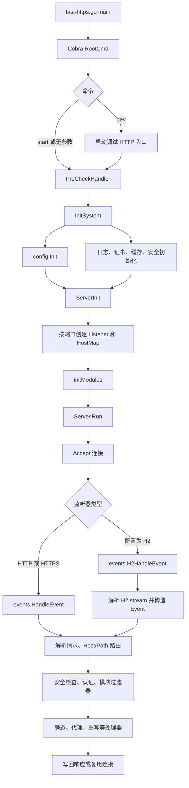

# Fast-Https 启动与运行逻辑

本文以当前代码实现为准，说明 Fast-Https 从进程启动、配置加载、创建监听器，到处理 HTTP/HTTPS/H2 请求和配置重载的主要路径。建议结合文中的代码入口阅读。

## 1. 总体流程

## 2. 进程入口与命令

入口位于 [`fast-https.go`](../fast-https.go)。程序设置默认日志级别后创建并执行 `cmd.RootCmd()`。命令由 [`cmd/commands.go`](../cmd/commands.go) 分发：

| 命令 | 当前行为 |
| --- | --- |
| `start` | 预检查、系统初始化、启动服务器；非 Windows 平台随后调用 daemon 实现 |
| 无参数 | 与 `start` 相同 |
| `dev` | 提高日志级别、尝试启动 `:10000` 的 HTTP 服务，然后走相同的预检查和服务器初始化；不执行 `StartHandler` 中的 daemon 步骤 |
| `stop` | 读取 PID 文件并对进程调用 `os.Kill` |
| `reload` | 读取 PID 并发送平台对应的重载信号 |
| `install` / `uninstall` | 使用 `kardianos/service` 安装或卸载系统服务 |
| `status` | 读取 `fast-https.pid`。进程在运行时打印 pid 并以 0 退出；没有 pid 文件，或文件里的 pid 已经没有对应进程时，以非 0 退出 |

`start` 与 `dev` 的主要启动路径在 `StartHandler` 和 `DevStartHandler`。两者都会先执行 `PreCheckHandler`，再调用 `initialization.InitSystem()`、`server.ServerInit()` 和 `Server.Run()`。

## 3. 启动检查与系统初始化

### 3.1 启动前检查

`PreCheckHandler` 依次进行以下工作：

1. 调用 `config.CheckConfig()` 校验主配置以及 include 配置。配置验证检查 JSON 结构、至少一个 server/location、监听端口、代理地址、TLS 文件和 include 路径等必要条件。
2. 调用 `server.ScanPorts()`。
3. 检查 PID 文件：如果 PID 对应进程仍在运行则终止本次启动；没有 PID 文件或进程已经退出时允许继续。

**实现注意：** 当前 `ScanPorts()` 通过 `listener.FindOldPorts()` 检查进程内的 `listener.GLisinfos`，并非直接遍历主配置中的所有端口。在新进程启动时该列表通常还为空，因此实际端口冲突仍可能直到创建监听器时才被发现。

### 3.2 `InitSystem` 初始化顺序

系统初始化位于 [`init/init.go`](../init/init.go)：

1. `config.Init()` 读取运行配置并加载 MIME 类型映射。
2. `MessageInit()` 启动异步日志消息处理，并初始化 system/access/error/safe 日志。
3. `CertInit()` 初始化本地 CA；对于启用 SSL 的 server，如果默认证书文件不存在则尝试生成证书。
4. 从磁盘加载代理缓存，并启动定期过期清理 goroutine。
5. 调用 `safe.Init()` 初始化安全模块。

`ServerInit()` 后续还会再次调用安全模块初始化，并注册动态访问日志格式。因此安全模块会在系统初始化和监听器初始化阶段分别触达。

### 3.3 配置来源和路径

运行时主配置路径由 `config.CONFIG_FILE_PATH` 决定，默认是 `./config/fast-https.json`；MIME 文件默认是 `./config/mime.json`。根配置通过 `http.server` 定义站点，通过 `http.include` 引入额外 JSON 配置；被 include 的文件描述单个 server。加载后的结构保存在全局 `config.GConfig` 中。

`LoadFile` 在监听前把站点 root、证书、日志目录和 include 路径转成绝对路径。Linux/amd64 的 `start` 在容器外仍会 fork，调用的是 `Daemon(1, 1)`，子进程保持原来的工作目录。容器里存在 `/.dockerenv` 或 `/run/.containerenv`，或者设置了 `FASTHTTPS_FOREGROUND=1` 时，进程以前台方式运行，不 fork。

开发模式额外启动 `http.ListenAndServe("0.0.0.0:10000", nil)`。当前代码中未发现该默认 mux 上注册 pprof handler 的实现；仅启动该端口并不意味着 `/debug/pprof/` 一定可用。

## 4. 从配置到监听器

监听器由 [`modules/core/listener/listener.go`](../modules/core/listener/listener.go) 中的 `ListenWithCfg()` 创建，主要经过以下转换：

1. `SortByPort()` 按 `listen` 配置中的端口合并监听器，并根据 `ssl`、`h2`、`tcp` 标记确定监听类型。
2. `processListenData()` 将每个 server/location 转成 `ListenCfg`。其中 `location.url` 会编译为正则表达式；代理地址、静态目录、证书、认证、安全和缓存配置也随之装入。
3. `processHostMap()` 按 `server_name:port` 建立虚拟主机到 location 列表的映射。
4. TCP 监听器绑定 `0.0.0.0:<port>`；SSL 监听器在 TCP listener 上包装 TLS。每个 listener 保存连接处理上下文以及取消函数，供关闭和重载使用。

监听器的 `LisType` 用于后续选择连接处理方式：普通 TCP/HTTP、TLS，以及配置为 H2 的监听路径。TLS 配置由 `tls.LoadX509KeyPair` 加载；证书和私钥路径来自相应 server 配置。

## 5. 连接与请求处理

### 5.1 接收连接

`Server.Run()` 为每个 listener 启动一个 `serveListener` goroutine，然后阻塞等待退出信号。`serveListener` 循环调用 `Accept()`，每接受一个连接就启动独立 goroutine：

- `LisType == 10`：调用 `events.H2HandleEvent()`。
- 其他类型：调用 `events.HandleEvent()`。

监听器上下文被取消或 `Accept()` 失败时，accept 循环退出。

### 5.2 HTTP/1.x 事件链

普通连接处理位于 [`modules/core/events/events.go`](../modules/core/events/events.go)：

1. 创建 `core.Event`，执行连接过滤器，包括安全限流/黑名单检查。
2. 读取请求数据并解析 request line、headers 和 body；解析过程中提取 Host、查询参数，并根据 Content-Length 等信息继续读取请求体。
3. `RequestFilter` 按 Host 查找虚拟主机，再按配置顺序逐个匹配 `location.url` 正则。命中后得到该 location 的 `ListenCfg`。
4. 对命中的 location 执行安全计数、认证检查，并根据 `ListenCfg.Type` 从 `core.GRRCHT` 处理器表中取出解析、过滤和请求处理函数。
5. 执行模块过滤器，再进入对应请求处理器，生成或直接写出响应。
6. 根据请求/响应的连接语义决定关闭连接或继续处理下一次请求。

当前核心处理器由包初始化时注册：

| location 类型 | 处理模块 | 主要行为 |
| --- | --- | --- |
| `local` | `modules/static` | 根据 root/index/try 查找并返回静态文件 |
| `proxy` + HTTP/HTTPS upstream | `modules/proxy` | 转发请求、读取上游响应并返回；可应用 proxy header、应用防火墙和缓存配置 |
| `rewrite` | `modules/rewrite` | 返回重定向响应 |
| `devmod` | `modules/dev_mod` | 开发模块处理 |

代理、静态和重写模块由 server 包 blank import，利用 Go 包初始化函数向 `core.GRRCHT` 注册处理器。WebSocket upgrade 在 HTTP 解析过滤阶段识别，之后由监听过滤器交给 WebSocket 模块。TCP 代理则按 TCP 类型的监听器在 HTTP 解析前分流。

### 5.3 HTTP/2 事件链

H2 连接由 [`modules/core/events/events_h2.go`](../modules/core/events/events_h2.go) 处理：读取 H2 connection preface，启动帧写循环并读取 SETTINGS/stream 帧。类型大于 `0x9` 的帧丢掉载荷后继续读。HPACK 索引非法时，该流发出 `RST_STREAM`（`COMPRESSION_ERROR`）并关闭。写出 DATA 时若对端窗口不够，写循环停止并关闭连接。每个 stream 在 callback 中转换成 `core.Event` 和 H2 request，再复用普通的 `EventHandler()` 完成 Host/Path 路由、安全检查、认证和模块分发。响应通过 HEADERS/DATA frame 写回；监听器关闭时尝试对 H2 连接做限时 graceful close。

## 6. 停止与配置重载

### 停止

`stop` 命令读取 PID 文件并调用 `process.Signal(os.Kill)`。这不是由 `Server.SigHandler()` 接收的优雅停止信号；在 Unix 上 `os.Kill` 对应不可捕获的强制终止信号。服务器的信号 handler 对 `SIGTERM` 和 `SIGQUIT` 调用 wait group 完成通知。`SIGINT` 在各平台都调用 `Reload()`。

### 重载

`reload` 命令向 pid 发送 `SIGINT`。Windows 上先发 Ctrl+Break，再试 Ctrl+C。服务器收到后调用 `Server.Reload()`：

1. 清空并重新加载配置。文件无效时保留上一份配置，不继续切换监听。
2. 配置加载成功后，按当前 `log_root` 重新打开 `system.log`、`access.log`、`error.log`、`safe.log`。新目录打不开时保留原来的四个文件，并继续切换监听。
3. 对比新旧端口，区分新增、移除和保留端口。
4. 相同端口且监听类型不变时复用 listener，并更新 `Cfg`/`HostMap`。
5. 移除端口时取消上下文并关闭 listener；新增端口建立 listener 并启动 accept goroutine。
6. 重新初始化安全模块和动态日志。

同一端口且仍是 SSL 时，监听套接字不重新绑定。新的证书文件能解析时，下一次 TLS 握手使用新证书。证书文件缺失时，配置重载被拒绝，原来的监听和证书保持不变。

## 7. 阅读代码的推荐顺序

1. [`fast-https.go`](../fast-https.go) → [`cmd/commands.go`](../cmd/commands.go)：入口、命令与启动前检查。
2. [`init/init.go`](../init/init.go) → [`config/config.go`](../config/config.go)：系统初始化和配置转换。
3. [`modules/core/server/server.go`](../modules/core/server/server.go) → [`modules/core/listener/listener.go`](../modules/core/listener/listener.go)：服务生命周期和 socket 监听。
4. [`modules/core/events/events.go`](../modules/core/events/events.go) → [`modules/core/filters/filters.go`](../modules/core/filters/filters.go) → [`modules/core/core.go`](../modules/core/core.go)：请求解析、路由与处理器注册。
5. 按需继续阅读 `modules/static`、`modules/proxy`、`modules/rewrite`、`modules/safe` 和 `modules/core/events/events_h2.go`。
