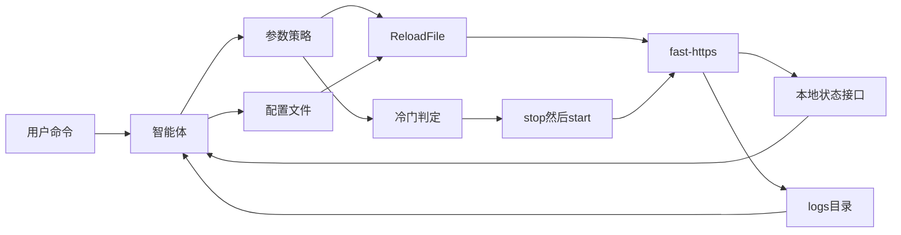

# Fast-Https 2.0 产品设计

版本：2.0 设计稿，2026-10-08。当前已发布的产品版本是 `V1.3.2`。本文只规划 2.0，不改服务器代码。

2.0 的变化是增加一个基于大模型的智能体。它做两件事。一是读取服务器运行状态和日志，自主决定参数怎么调：能热更新的立刻生效，必须重启才生效的等到请求冷门时段，由智能体停机再启动。二是在收到用户命令后，按当前平台把站点配置写进现有的 JSON 文件。

当前代码里还要做的发布和稳定性工作仍以 [iteration-plan.md](iteration-plan.md) 为准。2.0 依赖其中的状态查询（R6）和上游故障转移（R8），不替代那份计划。已落地的重载回滚、日志目录和安全模块见 [iteration-hardening-plan.md](iteration-hardening-plan.md)。启动与请求路径见 [about.md](about.md)。

## 1. 目标与非目标

### 1.1 目标

- 智能体根据错误率、连接数、限流拒绝和日志内容自主调整运行参数。
- 策略模块限制可改的键、取值范围、单次步长和冷却时间。落在范围内的变更不再等人工确认。
- 热更新走现有的 `config.ReloadFile`。校验失败时保留上一份 `GConfig`，监听不切换。
- 必须重启才生效的参数先写入待生效配置。请求进入冷门时段后，智能体执行 `stop`，再用新配置 `start`。
- 模型可替换，使用操作者配置的 OpenAI 兼容接口。请求处理路径不调用模型。
- 收到用户命令后，按该命令和当前安装布局写出 `config/fast-https.json` 或 `config/conf.d` 下的站点文件。已有且命令没有点名的站点保留。

### 1.2 非目标

- 不把大模型放进 Accept、请求解析或响应写出。
- 没有用户命令时，不由智能体自行新增监听、关闭 TLS、改站点根目录，或把流量转到策略以外的上游。用户命令本身是对这些结构项的授权。
- 冷门启停不是为了在空闲时把站点长期关掉。停机只覆盖“新参数必须靠进程重启才生效”的那一次，拉起后继续对外服务。
- 不在 2.0 里重写 HTTP/1.1、HTTP/2、静态站点或反向代理的数据面。

## 2. 架构

智能体是本机控制进程，与 `fast-https` 分开。数据面保持现有路径：`fast-https.go` 进入 `cmd`，`init.InitSystem` 加载配置，`server.ServerInit` 按 `listen` 建立监听，每个端口在独立协程里 Accept。



控制面分两档，避免每个请求都调用模型。

| 环 | 何时运行 | 依据 | 动作 |
| --- | --- | --- | --- |
| 快环 | 秒级 | 错误率、连接数、限流拒绝次数 | 只调速率、突发和临时黑名单，立即热更新。不调用模型，也不为此停机 |
| 慢环 | 十秒到数分钟 | 状态摘要和脱敏日志 | 调用模型，自主给出参数变更。能热更新的立即生效；必须重启的进入待生效队列 |

策略模块在快环和慢环上都执行。模型输出无法解析、超出范围或命中人工确认项时，本次变更丢弃，服务器保持当前配置。用户命令走第 4 节，不经过“结构项必须人工再确认一次”的限制，但仍然要先通过配置校验。

## 3. 运行闭环

1. 采集。状态接口提供进程、监听端口、活动连接、最近窗口的请求数和错误数。日志从 `logs/access.log`、`logs/error.log`、`logs/safe.log`、`logs/system.log` 增量读取。
2. 判断。快环用本地规则。慢环把脱敏摘要交给模型，模型返回一份结构化变更，而不是自由文本。
3. 策略校验。逐项检查键是否允许、数值是否在最小/最大之间、相对当前值的步长、以及冷却时间是否已过。
4. 生效。
   - 热更新：写成一份候选配置，调用 `config.ReloadFile`。失败则内存配置和监听都不变。
   - 待生效：写入待生效文件，不立刻停机。冷门判定通过后，智能体执行 `stop`，再以待生效配置 `start`。
5. 健康确认。热更新后看下一个短窗口的错误率。启停后确认进程 pid 可读、原端口重新监听。
6. 回退。热更新后错误率超过回退阈值时，把上一份配置再交给 `ReloadFile`。启停失败或新进程健康检查不通过时，用上一份可用配置再执行一次 `start`。

`ReloadFile` 今天的行为是：先校验文件，校验或加载失败时恢复之前的 `GConfig`。2.0 继续使用这个行为，不另写一套“模型直接改内存”的入口。

## 4. 按命令生成配置

这是第三条路，和快环、慢环分开。用户给出命令后，智能体把这台机器上的站点配置写完，而不是只改一个运行参数。

命令入口在本机：`fast-https agent "……"`，或 `agent.listen` 上只绑定回环地址的配置接口。模型根据三样输入写文件：

- 用户原话。
- 当前平台和安装布局。
- 已经存在的 `config/fast-https.json` 和 `config/conf.d` 下的 JSON。命令没有点名的站点保持原样。

写出的仍是现在的配置格式。主文件使用 `http.server`；额外站点写成 `http.include` 指向的单个 server JSON。写入前调用现有的配置校验。校验失败不替换正在使用的文件。校验通过后：

- 服务器没有在运行：只把文件落盘，不自行 `start`，除非这条命令明确要求启动。
- 服务器正在运行，且变更都能热更新：调用 `config.ReloadFile`。
- 服务器正在运行，且含有必须重启才生效的项：写入待生效配置，仍按第 5 节等到冷门时段再 `stop` / `start`。

命令含糊到无法确定端口或目录时，智能体先追问，不猜测一个端口或路径。代理目标只使用用户提到的地址，或用户明确说的本机服务。模型密钥不写进站点配置。

### 4.1 平台路径

基目录来自编译布局，智能体按它填写 `root`、证书和 include，而不是写死一种路径。

| 布局 | 基目录 | 路径写法 |
| --- | --- | --- |
| 源码运行、Windows | `./`（`config/base_dir.go`） | 相对当前工作目录，例如 `./httpdoc/root`、`config/cert/localhost.pem` |
| RPM（`-tags=rpm`） | `/usr/share/fast-https/` | 绝对路径，例如 `/usr/share/fast-https/httpdoc/root` |
| Alpine 镜像 | `/app` | 绝对路径，例如 `/app/httpdoc/root` |
| Ubuntu 24.04、CentOS 7 镜像 | `/usr/local/fast-https` | 绝对路径，例如 `/usr/local/fast-https/httpdoc/root` |

### 4.2 例子

用户在源码目录执行：

```text
fast-https agent "在 8080 提供 ./httpdoc/root 的静态站，并把 /api 反代到本机 9000"
```

智能体在保留文件里已有站点的前提下，写出或并入：

```json
{
  "listen": 8080,
  "server_name": "localhost",
  "location": [
    {
      "url": "/",
      "type": "local",
      "root": "./httpdoc/root",
      "index": ["index.html", "index.htm"]
    },
    {
      "url": "/api",
      "type": "proxy",
      "proxy_pass": "http://127.0.0.1:9000"
    }
  ]
}
```

同一句话在 RPM 上，`root` 写成 `/usr/share/fast-https/httpdoc/root`。在 Alpine 镜像上写成 `/app/httpdoc/root`。在 Ubuntu 或 CentOS 镜像上写成 `/usr/local/fast-https/httpdoc/root`。`listen` 和 `proxy_pass` 不随安装目录改变。

## 5. 冷门时段启停

冷门判定只用本地计数，不调用模型。

同时满足下面四条才允许 `stop`：

- 最近一个判定窗口内的新连接数低于阈值。
- 同一窗口内进行中的请求数低于阈值。
- 该状态已持续达到最短空闲时间。
- 待生效队列非空，且距离上一轮启停已超过冷却时间。

任一情况出现则放弃本轮停机，待生效配置保留到下一个冷门窗口：

- 窗口内出现新的请求或连接。
- 服务器正在执行 `reload`。
- 上一轮启停仍在冷却。
- 待生效内容含有尚未人工确认的结构项。

停机顺序是 `stop`，确认 pid 消失后再 `start`。`start` 使用待生效配置。新进程若不能在超时内监听成功，智能体用上一份可用配置启动，并记下失败原因到 `logs/system.log`。

建议的默认值写在 `agent.cold` 里，实施前还可以改：

- 判定窗口 60 秒
- 窗口内新连接数阈值 0
- 进行中请求数阈值 0
- 最短空闲时间 180 秒
- 启停冷却 30 分钟

阈值为 0 表示“这段时间没有新访问”才重启。若业务不能接受绝对空闲，把新连接阈值调到一个小整数，同时保留进行中请求必须为 0，避免打断已经接受的连接。

## 6. 观测输入

2.0 需要一份本机状态，供快环、慢环和冷门判定共用。迭代计划中的 R6 目前只规划了 `status` 命令。2.0 在此之上增加本机只监听回环地址的状态输出，至少包含：

- 进程 pid、启动时间、当前配置路径
- 每个 `listen` 的端口、协议标记（`ssl`、`h2`、`tcp`）和活动连接数
- 最近 60 秒的接受连接数、完成请求数、4xx/5xx 数、限流拒绝数
- 最近一次 `reload` 或启停的结果和时间
- 待生效配置是否存在

日志仍是现有四个文件。智能体只追加读取，不改日志格式。重载后重新打开日志文件（迭代计划 R3）完成后，慢环才能在热更新之后继续读到新文件。

送给模型的内容是摘要：计数、若干条脱敏后的错误日志和安全日志。访问日志中的查询串、`Cookie` 和 `Authorization` 在离开进程前删除。

## 7. 参数分级

每一项自动参数都要有最小值、最大值、冷却时间和单次最大变化。下面“现状”指 `V1.3.2` 代码里已经有的字段。

### 7.1 智能体可自主热更新

| 参数 | 现状 | 说明 |
| --- | --- | --- |
| `ServerLimit.Rate`、`ServerLimit.Burst` | `config.ServerLimit` 已有字段 | 全局限流。快环优先使用 |
| `PathLimit.Rate`、`PathLimit.Burst` | `config.PathLimit` 已有字段 | 单个 location 的限流 |
| `BlackList` 临时条目 | `Fast_Https.BlackList` 已有，当前从 `http.blaklist` 读入 | 只增加带过期时间的临时项，到期删除。不删除操作者手工写入的永久项 |
| 缓存 `Valid` | `config.Cache.Valid` 已有 | 调整缓存有效期，不改缓存目录 `Path` |
| 日志级别 | 今天由进程启动参数和 `logger.Level` 决定，配置文件中还没有对应键 | 2.0 补成可重载项后，归入热更新 |

### 7.2 智能体可自主决策，但要等冷门启停

| 参数 | 现状 | 说明 |
| --- | --- | --- |
| 连接上限 | 尚未作为可重载运行参数 | 2.0 增加后，变更进入待生效队列 |
| keepalive | 结构体有 `KeepaliveTimeout`，当前配置加载和运行路径都还没有使用它 | 2.0 补上读取和生效点后，变更进入待生效队列 |
| 上游权重 | 依赖迭代计划 R8，当前没有故障转移和权重 | R8 若能热更新权重，则改为热更新；否则走冷门启停 |

### 7.3 自主调参时必须先人工确认

没有用户命令时，这些项即使模型提出，也只能记为待确认，不能直接写入热更新或待生效队列：

- `listen`（含新增端口、关闭端口、去掉 `ssl`）
- `ssl_certificate`、`ssl_certificate_key`
- location 的 `root`
- `proxy_pass` 的目标主机
- 认证口令和用户

人工确认之后，若该项必须重启才生效，仍等到冷门时段再 `stop` / `start`。没有用户命令时，智能体不能新增监听、关闭 TLS，或把代理目标改到允许列表之外。第 4 节的用户命令视为已经确认，可以写入这些字段，但仍然先校验，不能改到用户没有提到的上游。

## 8. 配置草案

智能体配置与业务 `location` 分开，放在主配置的 `agent` 段。下面是设计草案，当前的 `config/fast-https.json` 还没有这段。

```json
{
  "agent": {
    "enabled": true,
    "listen": "127.0.0.1:9100",
    "model": {
      "base_url": "http://127.0.0.1:11434/v1",
      "model": "local-model",
      "api_key_file": "config/agent/api_key"
    },
    "loop": {
      "fast_interval": "1s",
      "slow_interval": "60s"
    },
    "cold": {
      "window": "60s",
      "min_idle": "180s",
      "max_new_conns": 0,
      "max_inflight": 0,
      "restart_cooldown": "30m"
    },
    "policy": {
      "server_rate": { "min": 1, "max": 5000, "max_step": 0.5, "cooldown": "30s" },
      "server_burst": { "min": 1, "max": 1000, "max_step": 0.5, "cooldown": "30s" },
      "temp_blacklist_ttl": "15m"
    }
  }
}
```

`max_step` 为 0.5 表示单次变化不超过当前值的 50%。`api_key_file` 指向一个不进入发布包的本地文件。`listen` 只绑定回环地址，状态接口不对公网开放。

### 8.1 一次冷门启停的例子

慢环观察到 `443` 上握手失败持续升高，并在错误日志里看到连接在下一次请求前被关掉。模型输出一份 2.0 才会读取的 keepalive 变更：

```json
{
  "changes": [
    { "path": "http.keepalive_timeout", "value": 30, "apply": "restart" }
  ],
  "reason": "handshake errors coincide with connections closing before the next request"
}
```

策略确认 `30` 落在 keepalive 允许范围内，且冷却已过。变更写入待生效配置，当前进程继续用旧值服务。随后 180 秒内新连接和进行中请求都为 0，智能体执行 `stop`，再 `start`。新进程监听成功后，待生效标记清除。若 `start` 失败，再用上一份配置启动，并把这次失败记入系统日志。

快环的例子更短：同一分钟限流拒绝从个位数升到连续超出阈值，智能体把 `ServerLimit.Burst` 提高一步并 `ReloadFile`，不调用模型，也不停进程。

## 9. 失败与安全

| 情况 | 行为 |
| --- | --- |
| 模型超时或返回无法解析 | 丢弃本次慢环结果。快环不受影响 |
| 变更超出最小值、最大值或步长 | 丢弃该项。其余合法项仍可生效 |
| 变更属于人工确认项且尚未确认 | 只记录建议，不写入待生效配置 |
| `ReloadFile` 校验失败 | 保持上一份 `GConfig` 和现有监听 |
| 热更新后短窗口错误率升高 | 用上一份配置再重载 |
| 冷门窗口被新请求打断 | 取消本次 `stop`，待生效配置留到下一窗口 |
| `stop` 之后 `start` 失败 | 用上一份可用配置再启动 |
| 状态接口不可用 | 快环和冷门启停都暂停。慢环可以继续读已有日志，但不执行启停 |
| 用户命令无法确定端口或目录 | 追问，不写文件 |
| 按命令生成的配置校验失败 | 不替换当前配置文件。服务器继续使用原来的文件 |

临时黑名单必须带过期时间。建议默认最长 15 分钟，到期由智能体删除。操作者写在配置里的永久黑名单不在此列。

密钥、模型地址和策略范围只出现在 `agent` 段。业务站点的 `server` / `location` 不保存模型调用信息。

## 10. 分期

| 阶段 | 内容 | 完成标准 |
| --- | --- | --- |
| P1 | 本机状态输出；参数策略执行器；变更只写日志，不改线上配置 | 状态能读到连接数和错误数；一份超范围变更会被拒绝 |
| P2 | 快环热更新速率、突发和临时黑名单 | 压测中限流拒绝升高后，`ReloadFile` 生效；非法配置不会换监听 |
| P3 | 待生效队列和冷门启停 | 空闲达到最短时间后完成一次 `stop`/`start`；有进行中请求时不停止；启动失败能回到上一份配置 |
| P4 | 慢环接入可替换的 OpenAI 兼容模型 | 模型不可用时快环和已排队的冷门启停仍按本地规则工作 |
| P5 | 按用户命令写配置 | 同一句话在源码目录、RPM 和容器里写出对应路径；校验失败不替换现有文件；未点名的站点保持不变 |

P3 之前需要迭代计划里的 R6 提供基本进程状态。上游权重放到 R8 有热更新或明确的重启语义之后，再交给智能体。P5 使用与 P4 相同的模型接口，模型不可用时不改配置文件。

## 11. 待定项

实施前建议定下这三个默认值。文档中的数字只是建议，不是已经生效的配置。

- 默认模型放在本机（草案里的 `127.0.0.1:11434`），还是允许一开始就配置远程接口。远程接口时，脱敏规则必须先于第一次调用落地。
- 冷门窗口用绝对空闲（新连接阈值 0、进行中请求 0、最短空闲 180 秒），还是允许一个很小的新连接阈值。
- 临时黑名单默认存活 15 分钟，是否需要按来源错误类型使用不同的上限。
