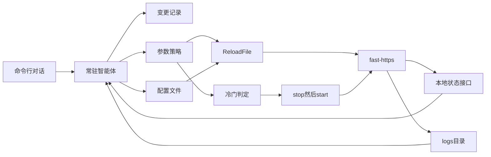

# Fast-Https 2.0 产品设计

版本：2.0 设计稿，2026-10-09。当前已发布的产品版本是 `V1.3.2`。本文只规划 2.0，不改服务器代码。

2.0 要降低部署、管理和日常运维的人工成本。操作者用本机命令行和大模型多轮对话，完成写配置、启动、查看状态、看错误和回滚。服务跑起来之后，智能体根据运行状态和日志，在策略范围内自主调整参数；必须重启才生效的参数，等到请求冷门时段再停机拉起。

当前代码里还要做的发布和稳定性工作仍以 [iteration-plan.md](iteration-plan.md) 为准。2.0 依赖其中的状态查询（R6）和上游故障转移（R8），不替代那份计划。已落地的重载回滚、日志目录和安全模块见 [iteration-hardening-plan.md](iteration-hardening-plan.md)。启动与请求路径见 [about.md](about.md)。

## 1. 目标与非目标

### 1.1 目标

- 命令行多轮对话完成第一次部署：写配置、预览、确认、启动，并回报端口是否在听。
- 同一对话管理运行中的服务：查看站点、状态、最近错误，解释最近一次自动变更，按命令回滚。
- 智能体根据错误率、连接数、限流拒绝和日志内容，在策略范围内自主调整运行参数。策略限制可改的键、取值范围、单次步长和冷却时间。
- 热更新走现有的 `config.ReloadFile`。校验失败时保留上一份 `GConfig`，监听不切换。
- 必须重启才生效的参数先写入待生效配置。请求进入冷门时段后执行 `stop`，再用新配置 `start`。等不到冷门时通知操作者，不无限挂起。
- 模型可替换，使用操作者配置的 OpenAI 兼容接口。请求处理路径不调用模型。

### 1.2 非目标

- 不把大模型放进 Accept、请求解析或响应写出。
- 没有用户命令时，不自行新增监听、关闭 TLS、改站点根目录，或把流量转到策略以外的上游。
- 冷门启停不是把站点整段时间关掉。停机只为了让必须重启的参数生效，拉起后继续对外服务。
- 不在 2.0 里做操作系统服务安装、防火墙、镜像构建，也不重写 HTTP/1.1、HTTP/2、静态站点和反向代理。

## 2. 架构

智能体是本机常驻控制进程，与数据面进程分开。数据面保持现有路径：`fast-https.go` 进入 `cmd`，`init.InitSystem` 加载配置，`server.ServerInit` 按 `listen` 建立监听，每个端口在独立协程里 Accept。

命令行不自己改文件。`fast-https agent` 连接常驻进程做多轮对话。常驻进程不在时，这条命令把它拉起来，再进入对话。快环、慢环和冷门启停只由这一个常驻进程执行，避免两个入口同时改同一份 JSON。



控制面有三类工作：

| 类型 | 何时 | 依据 | 动作 |
| --- | --- | --- | --- |
| 对话 | 操作者发起 | 多轮原话、当前配置、平台布局、状态摘要 | 预览后写配置、启动或停止、查询、回滚 |
| 快环 | 秒级 | 错误率、连接数、限流拒绝次数 | 只调速率、突发和临时黑名单，立即热更新。不调用模型，也不为此停机 |
| 慢环 | 十秒到数分钟 | 状态摘要和脱敏日志 | 调用模型，自主给出参数变更。能热更新的立即生效；必须重启的进入待生效队列 |

策略模块约束快环和慢环。模型输出无法解析、超出范围，或命中第 8.3 节的结构项时，本次自主变更丢弃。对话里的结构变更必须先给出 diff，操作者确认后才落盘。

## 3. 命令行对话

对话是部署和管理的主入口。一次会话记住本轮已经确认的端口、目录和上游，后续句子在这个上下文上修改，而不是每句都从空白配置重写。

操作者可以做这些事：

- 描述站点，生成或修改 `config/fast-https.json` 与 `config/conf.d` 下的 JSON。
- 查看当前站点和待生效变更。
- 查看进程、监听端口、最近错误和限流拒绝。
- 询问最近一次自动变更的前后值和依据。
- 回滚到上一条已记录的配置。
- 明确说出启动或停止。

写文件之前，智能体先展示将要改动的 diff，并说明哪些项会热更新、哪些要等冷门启停。操作者确认后才替换文件。命令含糊到无法确定端口或目录时先追问，不猜测。代理目标只使用用户提到的地址，或用户明确说的本机服务。

模型密钥不写进站点配置，也不进入对话记录的对外摘要。

### 3.1 第一次部署

还没有站点配置时，对话仍要能开始。模型地址和密钥放在独立的本机文件，例如 `config/agent.json`，不放进业务 `http.server`。没有这份文件时，`fast-https agent` 用内置的本机默认地址启动常驻进程，并在对话里请操作者确认模型。

第一次部署的顺序是：

1. 根据对话和当前安装布局生成配置。
2. 用现有校验检查 JSON。校验失败则只在对话里说明原因，不替换已有文件。
3. 展示 diff，等操作者确认。
4. 落盘。
5. 若操作者要求启动，或这是一次明确的部署命令，则执行 `start`。
6. 回报监听端口。启动失败时读 `logs/system.log` 与 `logs/error.log` 的尾部，在对话里说明原因，并允许下一句直接改配置再试。

2.0 不代做系统服务安装和防火墙。

### 3.2 平台路径

基目录来自编译布局。智能体按它填写 `root`、证书和 include。

| 布局 | 基目录 | 路径写法 |
| --- | --- | --- |
| 源码运行、Windows | `./`（`config/base_dir.go`） | 相对当前工作目录，例如 `./httpdoc/root`、`config/cert/localhost.pem` |
| RPM（`-tags=rpm`） | `/usr/share/fast-https/` | 绝对路径，例如 `/usr/share/fast-https/httpdoc/root` |
| Alpine 镜像 | `/app` | 绝对路径，例如 `/app/httpdoc/root` |
| Ubuntu 24.04、CentOS 7 镜像 | `/usr/local/fast-https` | 绝对路径，例如 `/usr/local/fast-https/httpdoc/root` |

### 3.3 例子

操作者在源码目录说：「在 8080 提供 `./httpdoc/root` 的静态站，并把 `/api` 反代到本机 9000，然后启动。」

智能体先给出 diff。确认后，在保留未点名站点的前提下写入：

```json
{
  "listen": 8080,
  "server_name": "localhost",
  "location": [
    {
      "url": "/",
      "type": "local",
      "root": "./httpdoc/root",
      "index": ["index.html", "index.htm"]
    },
    {
      "url": "/api",
      "type": "proxy",
      "proxy_pass": "http://127.0.0.1:9000"
    }
  ]
}
```

同一句话在 RPM 上，`root` 写成 `/usr/share/fast-https/httpdoc/root`。在 Alpine 镜像上写成 `/app/httpdoc/root`。在 Ubuntu 或 CentOS 镜像上写成 `/usr/local/fast-https/httpdoc/root`。`listen` 和 `proxy_pass` 不随安装目录改变。写完并启动后，对话回报 8080 是否已经在听。

服务器已经在运行时：都能热更新的变更确认后走 `ReloadFile`；含有必须重启才生效的项，确认后进入待生效队列，按第 5 节等到冷门时段。操作者若明确说「现在重启」，则不等待冷门窗口，立刻 `stop` 再 `start`。

## 4. 自主调参闭环

对话不参与时，快环和慢环按下面的顺序工作。

1. 采集。状态接口提供进程、监听端口、活动连接、最近窗口的请求数和错误数。日志从 `logs/access.log`、`logs/error.log`、`logs/safe.log`、`logs/system.log` 增量读取。
2. 判断。快环用本地规则。慢环把脱敏摘要交给模型，模型返回结构化变更，而不是自由文本。
3. 策略校验。逐项检查键是否允许、数值是否在最小和最大之间、相对当前值的步长，以及冷却时间是否已过。
4. 生效。热更新写成候选配置并调用 `config.ReloadFile`。必须重启的项写入待生效文件，不立刻停机。
5. 健康确认。热更新后看下一个短窗口的错误率。启停后确认 pid 可读、原端口重新监听。
6. 回退。热更新后错误率超过回退阈值时，把上一份配置再交给 `ReloadFile`。启停失败时用上一份可用配置再 `start`。

`ReloadFile` 今天的行为是：先校验文件，校验或加载失败时恢复之前的 `GConfig`。2.0 继续使用这个行为，不另写一套直接改内存的入口。

每次自主变更和每次对话确认都写入变更记录，见第 10 节。

## 5. 冷门时段启停

冷门判定只用本地计数，不调用模型。探活路径（可配置，默认不含业务 URL）不计入新连接。

同时满足下面四条才自动 `stop`：

- 最近一个判定窗口内的新连接数低于阈值。
- 同一窗口内进行中的请求数低于阈值。
- 该状态已持续达到最短空闲时间。
- 待生效队列非空，且距离上一轮启停已超过冷却时间。

任一情况出现则放弃本轮停机，待生效配置保留：

- 窗口内出现计入的新请求或连接。
- 服务器正在执行 `reload`。
- 上一轮启停仍在冷却。
- 待生效内容含有尚未确认的结构项。

待生效项等待超过 `max_wait` 仍没有冷门窗口时，常驻进程在系统日志记一条，并在下一次对话里告诉操作者。操作者可以说「现在重启」，也可以继续等。智能体不在超时后擅自停机。

停机顺序是 `stop`，确认 pid 消失后再 `start`。新进程若不能在超时内监听成功，用上一份可用配置启动，并把原因写入 `logs/system.log` 和变更记录。

建议默认值：

- 判定窗口 60 秒
- 窗口内新连接数阈值 0
- 进行中请求数阈值 0
- 最短空闲时间 180 秒
- 启停冷却 30 分钟
- 最长等待 24 小时

阈值为 0 表示这段时间没有计入的新访问才自动重启。不能接受绝对空闲时，把新连接阈值调成小整数，进行中请求仍保持 0。

## 6. 观测输入

快环、慢环、冷门判定和对话查询共用一份本机状态。迭代计划中的 R6 目前只规划了 `status` 命令，[`cmd/commands.go`](../cmd/commands.go) 里的 `statusHandler` 还是空实现。2.0 先把这个命令做实，再增加只监听回环地址的状态输出。至少包含：

- 进程 pid、启动时间、当前配置路径
- 每个 `listen` 的端口、协议标记（`ssl`、`h2`、`tcp`）和活动连接数
- 最近 60 秒的接受连接数、完成请求数、4xx/5xx 数、限流拒绝数
- 最近一次 `reload` 或启停的结果和时间
- 待生效配置是否存在

这些计数今天还没有统一出口。P1 要在接受连接、写响应和限流拒绝的路径上记录，不能只包一层空的 `status`。

日志仍是现有四个文件。智能体只追加读取。重载后重新打开日志文件（迭代计划 R3）完成之前，热更新之后的慢环不能假定还在读最新文件。

送给模型的内容是摘要：计数、若干条脱敏后的错误日志和安全日志。访问日志中的查询串、`Cookie` 和 `Authorization` 在离开本机之前删除。使用远程模型时，这条脱敏必须先于第一次调用。

## 7. 代码现状对 2.0 的约束

下面几项在 `V1.3.2` 里还不能直接交给智能体。设计按「补齐后再接入」排期，不把它们写成已经生效。

- `KeepaliveTimeout` 只在结构体里，配置加载和运行路径都没有使用。改这个字段后即使重启，今天也不会改变连接行为。
- 连接上限、可重载的日志级别、上游权重都还没有。上游权重依赖迭代计划 R8。
- `BlackList` 从 `http.blaklist` 读入，没有过期时间。临时黑名单要先有独立的过期字段，并保留操作者写入的永久项。
- 活动连接、4xx/5xx 和限流拒绝没有汇总计数。

## 8. 参数分级

每一项自动参数都要有最小值、最大值、冷却时间和单次最大变化。

### 8.1 可自主热更新

| 参数 | 现状 | 说明 |
| --- | --- | --- |
| `ServerLimit.Rate`、`ServerLimit.Burst` | `config.ServerLimit` 已有字段 | 全局限流。快环优先使用 |
| `PathLimit.Rate`、`PathLimit.Burst` | `config.PathLimit` 已有字段 | 单个 location 的限流 |
| 临时黑名单 | 永久名单已有，无过期时间 | 只增加带过期时间的临时项。不删除手工写入的永久项 |
| 缓存 `Valid` | `config.Cache.Valid` 已有 | 调整有效期，不改缓存目录 |
| 日志级别 | 由启动参数和 `logger.Level` 决定，配置里还没有对应键 | 补成可重载项后再归入热更新 |

### 8.2 可自主决策，但要等冷门启停

| 参数 | 现状 | 说明 |
| --- | --- | --- |
| 连接上限 | 还没有这个运行参数 | 补上读取和生效点后进入待生效队列 |
| keepalive | 结构体字段未被加载和使用 | 补上之后进入待生效队列 |
| 上游权重 | 依赖 R8 | R8 若能热更新权重，则改为热更新；否则走冷门启停 |

### 8.3 自主调参不能改，对话确认后可以写

没有用户确认时，这些项只记为建议：

- `listen`（含新增端口、关闭端口、去掉 `ssl`）
- `ssl_certificate`、`ssl_certificate_key`
- location 的 `root`
- `proxy_pass` 的目标主机
- 认证口令和用户

对话中展示 diff 并得到确认后，可以写入这些字段。校验仍然执行。代理目标不能改到用户没有提到的上游。若该项必须重启才生效，默认进入冷门队列；操作者说「现在重启」时立即启停。

## 9. 配置草案

业务站点仍在 `config/fast-https.json`。智能体自身的模型地址、策略和冷门参数放在 `config/agent.json`，避免第一次部署时还没有站点文件就无法对话。当前仓库里还没有这个文件。

```json
{
  "listen": "127.0.0.1:9100",
  "model": {
    "base_url": "http://127.0.0.1:11434/v1",
    "model": "local-model",
    "api_key_file": "config/agent/api_key"
  },
  "loop": {
    "fast_interval": "1s",
    "slow_interval": "60s"
  },
  "cold": {
    "window": "60s",
    "min_idle": "180s",
    "max_new_conns": 0,
    "max_inflight": 0,
    "restart_cooldown": "30m",
    "max_wait": "24h",
    "ignore_paths": ["/healthz"]
  },
  "policy": {
    "server_rate": { "min": 1, "max": 5000, "max_step": 0.5, "cooldown": "30s" },
    "server_burst": { "min": 1, "max": 1000, "max_step": 0.5, "cooldown": "30s" },
    "temp_blacklist_ttl": "15m"
  }
}
```

`max_step` 为 0.5 表示单次变化不超过当前值的 50%。`api_key_file` 不进入发布包。`listen` 只绑定回环地址。

### 9.1 一次自主变更

慢环在 keepalive 的读取和生效已经补上之后，才可以根据握手失败把 `http.keepalive_timeout` 调到策略允许的值，并标记为 `restart`。变更进入待生效队列，当前进程继续用旧值服务。出现冷门窗口后执行 `stop` 和 `start`。超过 `max_wait` 仍无冷门窗口时，只通知操作者。

快环不调用模型：限流拒绝在短时间内连续超出阈值时，把 `ServerLimit.Burst` 提高一步并 `ReloadFile`。

## 10. 变更记录

每次对话确认、热更新、待生效、启停和回滚都追加一条记录，供对话查询。至少包括：

- 时间、来源（对话、快环、慢环）
- 改了哪个键，旧值和新值
- 依据：规则名，或模型返回的短原因
- 生效方式：热更新、等待冷门、立即重启、仅落盘
- 结果：成功、校验失败、已回滚

记录放在 `logs/agent.log`，不写入访问日志。操作者可以问「刚才为什么改了 Burst」，对话从这里回答，而不是再读四份原始日志。

## 11. 失败与安全

| 情况 | 行为 |
| --- | --- |
| 模型超时或返回无法解析 | 丢弃本次慢环或本轮生成结果。快环不受影响 |
| 自主变更超出范围或步长 | 丢弃该项 |
| 自主调参碰到结构项 | 只记录建议，不写入待生效配置 |
| 对话尚未确认 | 不替换配置文件 |
| 用户命令无法确定端口或目录 | 追问，不写文件 |
| 生成的配置校验失败 | 不替换当前文件，在对话里说明原因 |
| `ReloadFile` 校验失败 | 保持上一份 `GConfig` 和现有监听 |
| 热更新后短窗口错误率升高 | 用上一份配置再重载 |
| 冷门窗口被新请求打断 | 取消本次 `stop`，待生效配置留下 |
| 等待冷门超过 `max_wait` | 通知操作者，不自动停机 |
| `stop` 之后 `start` 失败 | 用上一份可用配置再启动 |
| 状态接口不可用 | 快环和冷门启停暂停。对话仍可看已有日志，但不执行启停 |

临时黑名单必须带过期时间。建议默认最长 15 分钟。永久黑名单不由智能体删除。

## 12. 分期

先做操作者马上用得上的查询和对话，再做无人值守的调参。P1 和 P2 在模型不可用时仍然有用。

| 阶段 | 内容 | 完成标准 |
| --- | --- | --- |
| P1 | 做实 `status` 和计数；常驻进程只记录变更，不改线上配置 | 能读到连接数、4xx/5xx 和限流拒绝；超范围变更被拒绝并写入变更记录 |
| P2 | 命令行多轮对话：预览、确认、写配置、启动、停止、查状态、回滚 | 同一句话在源码目录、RPM 和容器里写出对应路径；未确认不落盘；校验失败不替换文件；未点名的站点保持不变；启动失败能在对话里看到原因 |
| P3 | 快环热更新速率、突发和临时黑名单 | 限流拒绝升高后 `ReloadFile` 生效；非法配置不会换监听 |
| P4 | 待生效队列和冷门启停 | 空闲达到最短时间后完成一次 `stop`/`start`；有进行中请求时不停止；超过 `max_wait` 只通知；启动失败回到上一份配置 |
| P5 | 慢环接入可替换的 OpenAI 兼容模型 | 模型不可用时，对话写配置、快环和已排队的冷门启停仍按本地规则工作 |

P1 依赖迭代计划里的 R6，并且要补计数，不只是补命令输出。热更新之后的慢环依赖 R3 重新打开日志。上游权重放到 R8 有明确的热更新或重启语义之后，再交给智能体。

## 13. 待定项

文档中的数字只是建议，不是已经生效的配置。

- 默认模型放在本机（草案里的 `127.0.0.1:11434`），还是允许一开始就配置远程接口。远程接口时，脱敏先于第一次调用。
- 冷门窗口用绝对空闲，还是允许一个很小的新连接阈值。探活路径的默认列表是否只有 `/healthz`。
- 临时黑名单默认存活 15 分钟，是否按错误类型使用不同上限。
- 第一次部署在操作者只说「部署这个目录」时，是否默认执行 `start`。本文按「部署命令包含启动，单独改配置则只落盘」执行；若要改成一律启动，在实施前定下来。
